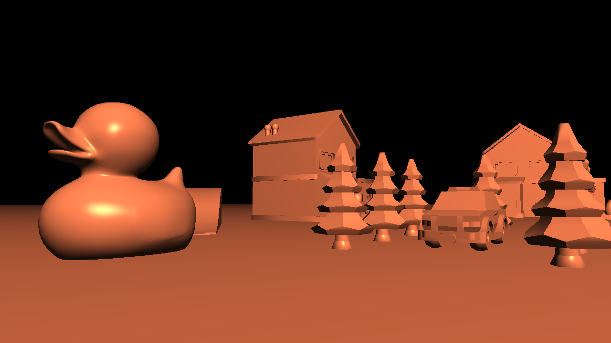
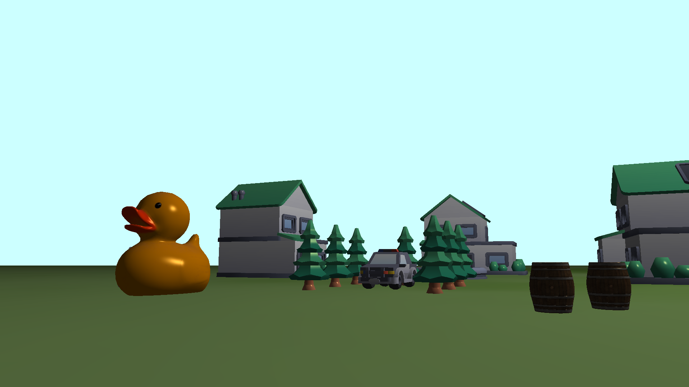
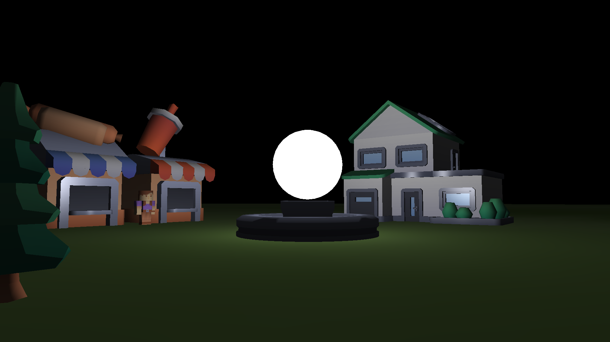
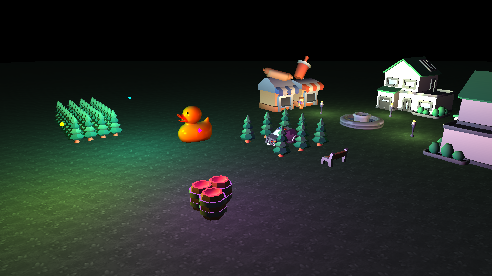

# Relax Game
a little pure c program 3d game

1.base model  

2.base light  

3.light map  

4.mulity light  

## Build
make && make run

## Third
SDL2
stb
glad
cglm

## Assets
https://www.kenney.nl/  
https://polyhaven.com/  

## Func
1.model render  
2.map load  
3.fps cmaera  
4.phong lighting  
5.light map
6.mulity light

## 一个大概的流程
0.平台，api，游戏分离  
1.绘制一个三角形（为模型服务）  
2.解析obj，绘制一个模型  
3.封装一个实体，包含模型，pos，rot，scale（为地图服务）  
4.解析地图，加载实体数组  
5.第一人称可以升降的相机  
6.风氏光照
7.多光源  
