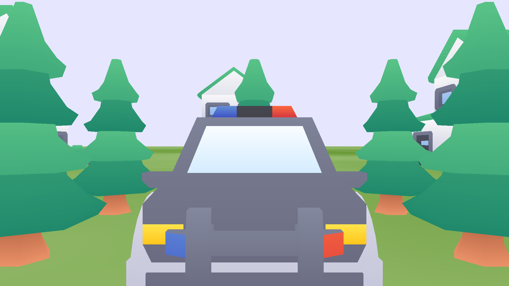
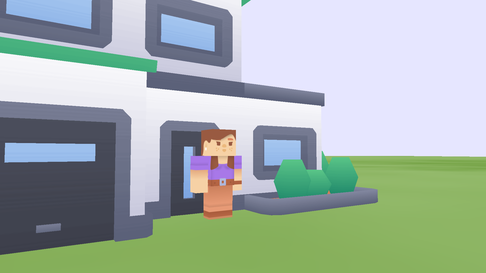

# Relax Render
a little pure c program 3d game

# Build
make && make run

## Third
SDL2
stb
glad
cglm

## Thanks
kenney

## 一个大概的流程
0.平台，api，游戏分离  
1.绘制一个三角形（为模型服务）  
2.解析obj，绘制一个模型  
3.封装一个实体，包含模型，pos，rot，scale（为地图服务）  
4.解析地图，加载实体数组  
5.camera，第一人称可以升降的相机  